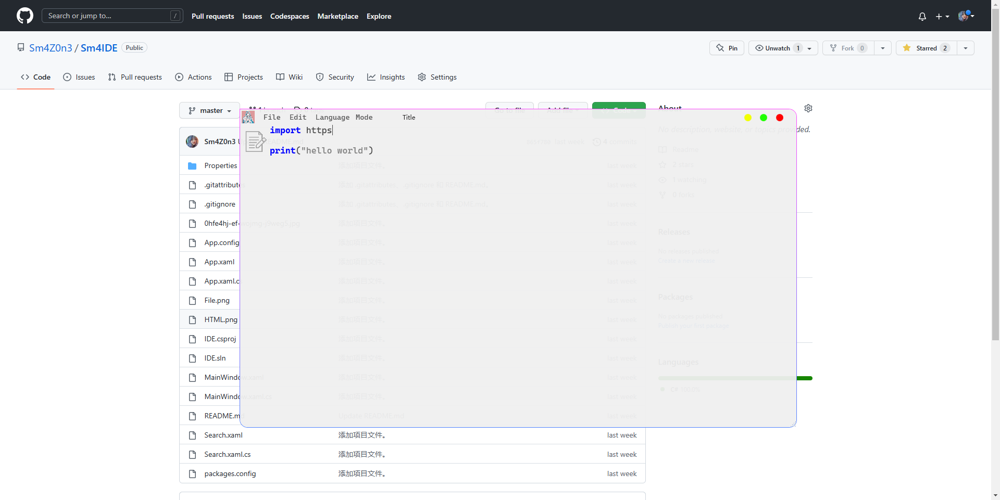
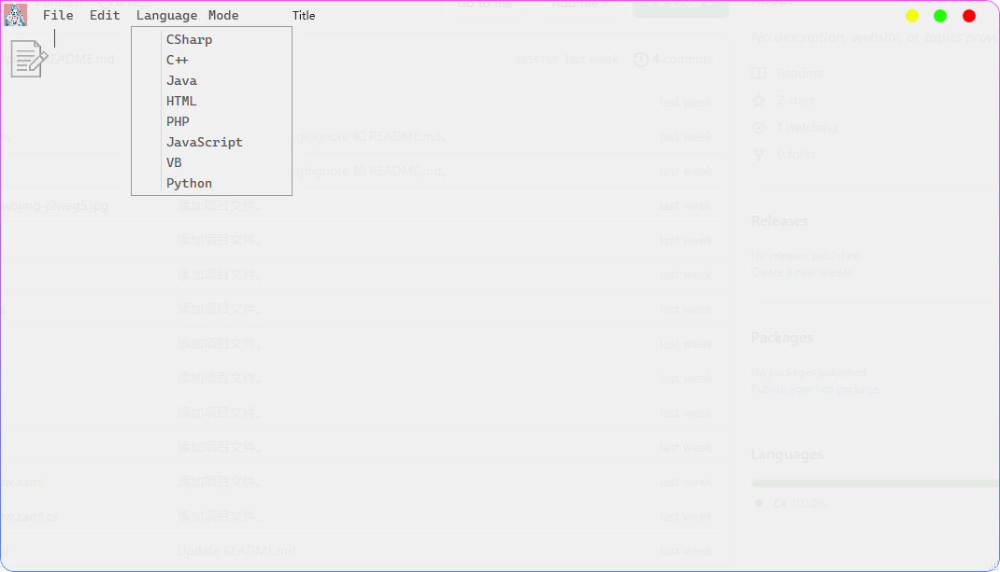
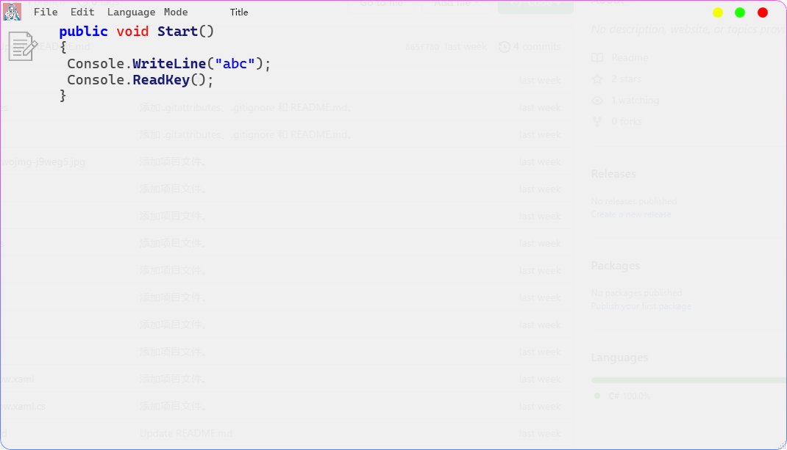
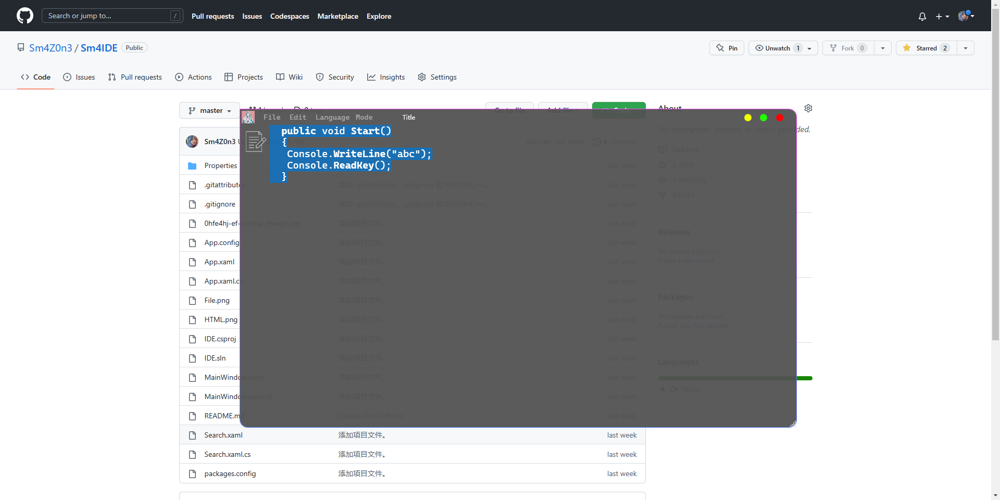

# IDE

一个使用CSharp编写的IDE代码编辑器，使用了ICSharpCode.AvalonEdit，如果你喜欢，请帮我点一颗Star，谢谢你

An IDE code editor written in CSharp, using ICSharpCode.AvalonEdit, if you like, please help me order a Star, thank you

交流群286106964

